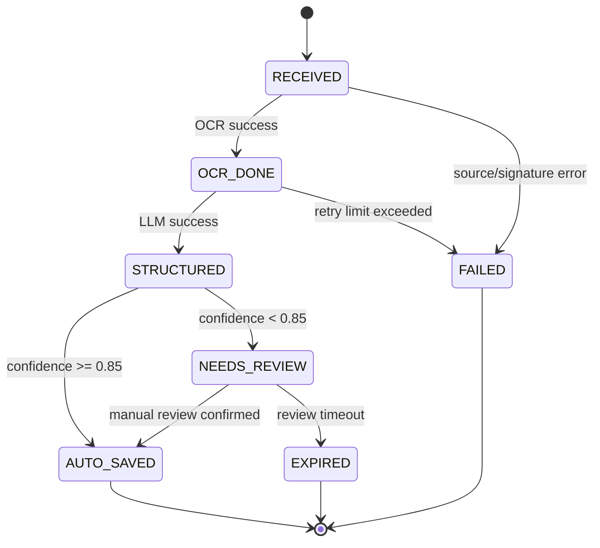
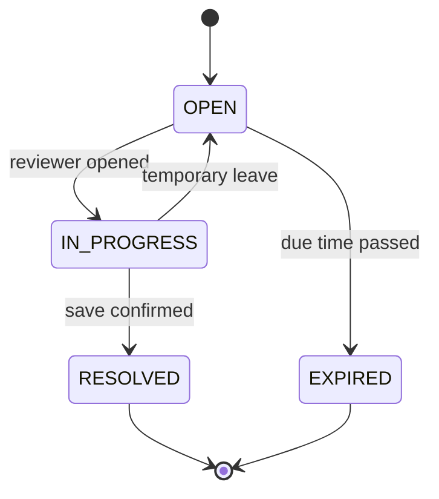
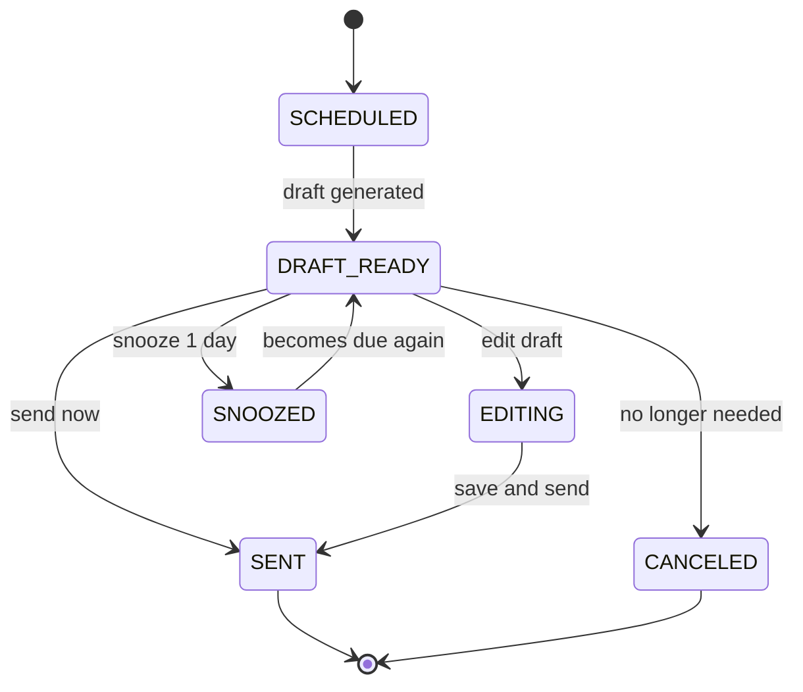

# State Transition Diagrams (v1)

## 1) `ingest_job`

## 2) `review_task`

## 3) `follow_up_task`

## Operational Notes

- 재시도는 워커 레벨에서 지수 백오프로 처리하고, 한계 초과 시 `FAILED`로 종료한다.
- `NEEDS_REVIEW`는 모바일 웹 콘솔의 `검수함`과 1:1 대응한다.
- `DRAFT_READY`에서 `SNOOZED` 전이는 카카오 알림톡 CTA(`내일로 미루기`)와 직접 연결된다.
